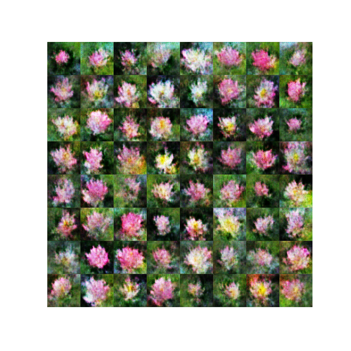

# FlowerGAN

A personnal project to implement GAN in order to generate images of flowers.  
Although i have a wider dataset at disposition, i started the training with only a sample in order to find out how much the architecture could learn.  
Although i am working with gpu, i used small images for the sake of computation time.  

These are a few results :  
  

We can follow the outputs of a fixed sample during training :  
  
One fun thing to look at is the outputs of the generator along a line between two sampled points from its input space :  

